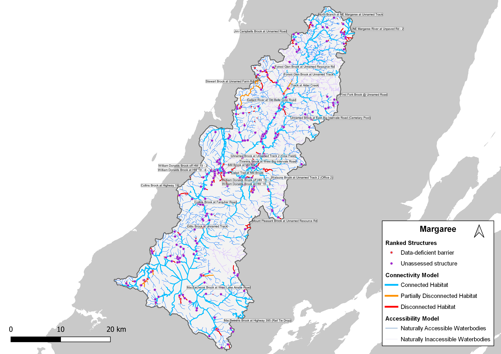

## Executive Summary {-}

```{python}
#| echo: false
#| output: false
from content.python.api_calls_v2 import (
    count_assessed_structures,
    get_habitat_stat_value,
    get_structure_count_value,
)

connected_habitat_km = get_habitat_stat_value(
    "msa", "as", "connected_naturally_accessible_habitat_km"
)
disconnected_habitat_km = get_habitat_stat_value(
    "msa", "as", "disconnected_naturally_accessible_habitat_km"
)
total_habitat_km = get_habitat_stat_value("msa", "as", "total_habitat_km")
connectivity_status_pct = get_habitat_stat_value(
    "msa", "as", "connectivity_status", digits=1
)

potentially_disconnect_structures = get_structure_count_value(
    "msa", "as", "structures_that_potentially_disconnect_habitat"
)
priority_barriers = get_structure_count_value("msa", "as", "priority_barriers")
non_actionable_barriers = get_structure_count_value(
    "msa", "as", "non_actionable_barriers"
)
further_field_assessment = get_structure_count_value(
    "msa", "as", "require_further_assessment"
)
assessed_structures = count_assessed_structures()
```

The Margaree Watershed Connectivity Restoration Plan (WCRP) was developed through partnership with the Margaree Salmon Association (MSA) and the Canadian Wildlife Federation and supported through the Atlantic Salmon Federation’s Wild Salmon Watershed program. The purpose of the Margree WCRP is to improve understanding of habitat connectivity for Atlantic Salmon (Salmo salar) in the Margaree watershed and inform efforts to close knowledge gaps and plan and prioritize restoration. Local data and knowledge are combined with connectivity modelling to estimate current connectivity status and identify structures that potentially block the most habitat. This informs the prioritization of field assessments to close the most significant knowledge gaps efficiently. Information from field assessments of barrier status and habitat condition are incorporated into the model, improving understanding of which barriers block the most habitat, and informing restoration prioritization. As knowledge gaps are closed and barriers are addressed, this plan will be revised to summarize progress and provide updated estimates of connectivity status and the status and relative importance of remaining structures. 

In the Margaree watershed, `{python} connected_habitat_km` km of Atlantic Salmon habitat are currently connected to the ocean and `{python} disconnected_habitat_km` km are disconnected from it. This means that `{python} connectivity_status_pct`% of the `{python} total_habitat_km` km of total habitat is connected. 

In the Margaree watershed, `{python} potentially_disconnect_structures` structures potentially disconnect Atlantic Salmon habitat. Of these, `{python} priority_barriers` are identified as barriers in need of rehabilitation (priority barriers), `{python} non_actionable_barriers` are identified as barriers that do not warrant rehabilitation (non-actionable), and `{python} further_field_assessment` require further field assessment. 

::: {#fig-map1}


 Map of Atlantic Salmon habitat and structures that are confirmed or potential barriers to fish passage in the Margaree watershed as of May 2026. Structure data were obtained from the Canadian Aquatic Barriers Database (aquaticbarriers.ca). The accessibility model represents areas of the watershed that Atlantic Salmon could access naturally in the absence of anthropogenic barriers. The habitat model represents the subset of accessible waterbodies that may be used by Atlantic Salmon for spawning and rearing. Available local knowledge and data were incorporated and overruled habitat model results. Thick orange lines represent partially disconnected habitat (upstream of a partial barrier), and thick red lines represent habitat considered to be fully disconnected (upstream of barriers or unassessed structures). Barriers in which passage was improved through implementation of this plan (via debris removal) are shown, but other excluded structures (e.g., those found to be passable) are not. 
:::


Figure 2: Habitat Accumulation Curve (HAC) showing structures in the Margaree watershed as of May 2026. Structures are ranked based on how much (km) weighted habitat for Atlantic Salmon is upstream. The y-axis represents the cumulative amount of potential habitat gain (km), down-weighted by 75% for first-order streams and 25% for second-order streams, and by passability (25%, 50%, or 75%) of partial barriers. Sets of structures are indicated by a grey line below the curve, indicating that gains from addressing the downstream structure alone would be less than the combined gains from addressing all structures in the set. Habitat upstream of unassessed structures is considered disconnected until field assessments are completed. Structures that were excluded as passable are not shown. 

This WCRP was initiated in 2025 as part of a larger conservation initiative led by the Atlantic Salmon Federation, called the Wild Salmon Watersheds program, which aims to protect, restore, and maintain resilient salmon watersheds, including the Margaree. Since then, several scoping and planning meetings were held between MSA, CWF, ASF, and the Nova Scotia Salmon Association (NSSA) to gather knowledge to develop and refine the initial connectivity models. The passability status of `{python} assessed_structures` structures was assessed in the field and field results reviewed with the planning team to determine next steps for identified barriers. 
